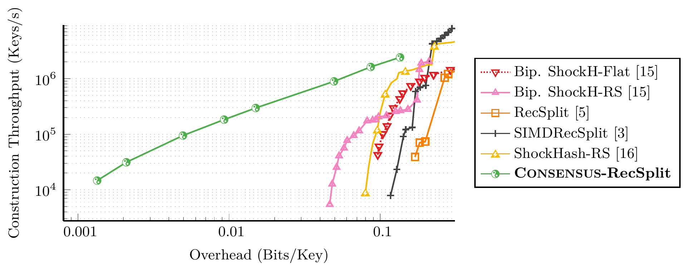

# ConsensusRecSplit

[](https://www.gnu.org/licenses/gpl-3.0)


A minimal perfect hash function (MPHF) maps a set S of n keys to the first n integers without collisions.
Perfect hash functions have applications in databases, bioinformatics, and as a building block of various space-efficient data structures.

ConsensusRecSplit is a perfect hash function with very small space consumption.
It is based on *Combined Search and Encoding of Successful Seeds* (Consensus), applied to
the recursive splitting idea of [RecSplit](https://github.com/vigna/sux/blob/master/sux/function/RecSplit.hpp).
Compared to previous approaches, ConsensusRecSplit achieves a space consumption that is orders of magnitude closer to the lower bound.
On 100 million keys and about an hour of construction time, it achieves a stunning 1.4448 bits per key, while the lower bound is 1.4427 bits per key.
RecSplit achieves 1.6127 bits per key in the same construction time.

While the RecSplit tree with Consensus has polynomial running time, the first splittings touch a large number of keys, hurting cache locality.
This is why we combine it with a simple [threshold-based k-perfect hash function](https://arxiv.org/abs/2310.14959).
We then perform combined search and encoding on the splitting seeds, while also combining the k-perfect buckets with one another.
The k-perfect hash function itself currently does not use Consensus, even though it should in the future to improve space efficiency.
The bucket size (k) gives a trade-off between query performance, construction performance, and space consumption.
Rather large k such as 32768 work best in our experiments.

### Construction Performance with 100M Keys



### Library usage

Clone this repository (with submodules) and add the following to your `CMakeLists.txt`.

```
add_subdirectory(path/to/ConsensusRecSplit)
target_link_libraries(YourTarget PRIVATE ConsensusRecSplit)
```

You can construct a ConsensusRecSplit perfect hash function as follows.

```cpp
std::vector<std::string> keys = {"abc", "def", "123", "456"};
consensus::ConsensusRecSplit<> hashFunc(keys, /* overhead = */ 0.01f);
std::cout << hashFunc("abc") << std::endl;
```

### Licensing
This code is licensed under the [GPLv3](/LICENSE).
